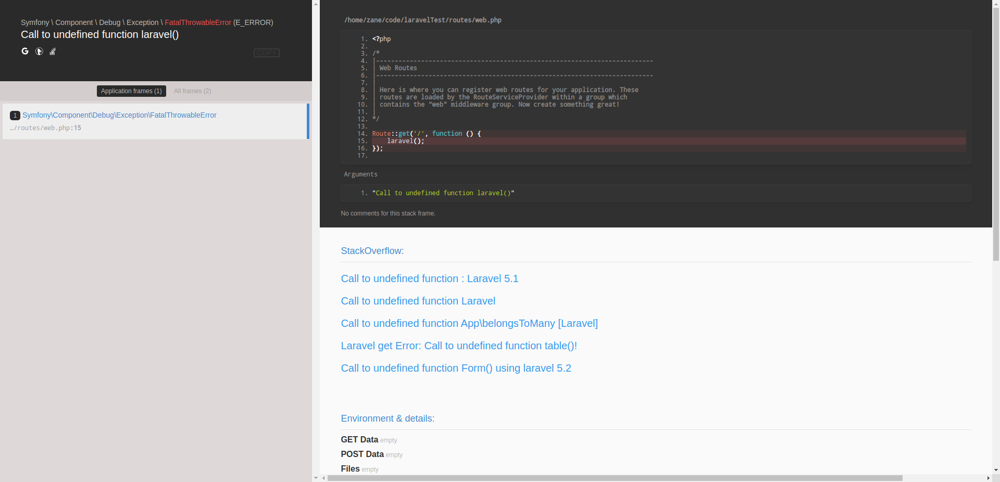

## Whoops-StackOverflow

在 Whoops 的基础之上根据报错信息增加 StackOverflow 前 5 条问答的小工具。

示例:



## 安装

> composer require zane/whoops-stackoverflow dev-master

## 如何使用

### 在 Laravel 5.6 中使用

#### 第一步

在 `app/Exceptions` 目录新建类文件 `WhoopsStackOverflowHandler.php`，内容如下:

``` PHP
<?php

namespace App\Exceptions;

use Illuminate\Foundation\Exceptions\WhoopsHandler;
use Whoops\Handler\PrettyStackOverflowPageHandler;

class WhoopsStackOverflowHandler extends WhoopsHandler
{
    /**
     * Create a new Whoops handler for debug mode.
     *
     * @return \Whoops\Handler\PrettyStackOverflowPageHandler
     */
    public function forDebug()
    {
        return tap(new PrettyStackOverflowPageHandler, function ($handler) {
            $handler->handleUnconditionally(true);

            $this->registerApplicationPaths($handler)
                ->registerBlacklist($handler)
                ->registerEditor($handler);
        });
    }
}
```

#### 第二步

修改类文件 `app/Exceptions/Handler.php`，增加 `whoopsHandler` 方法，内容如下：

``` PHP
/**
 * Get the Whoops handler for the application.
 *
 * @return \Whoops\Handler\PrettyStackOverflowPageHandler
 */
protected function whoopsHandler()
{
    return (new WhoopsStackOverflowHandler)->forDebug();
}
```

现在 Laravel 就已经在使用 Whoops-StackOverflow 了喔，有兴趣就测试一下吧！

### 一般使用方式

Whoops-StackOverflow 本质只是一个 Whoops 的 `Handler`，所以只需要改一下原来 Whoops 的 `Handler` 就好了。

示例代码如下：

``` PHP
$whoops = new \Whoops\Run;
$whoops->pushHandler(new \Whoops\Handler\PrettyStackOverflowPageHandler);
$whoops->register();
```

### 开源协议

MIT
